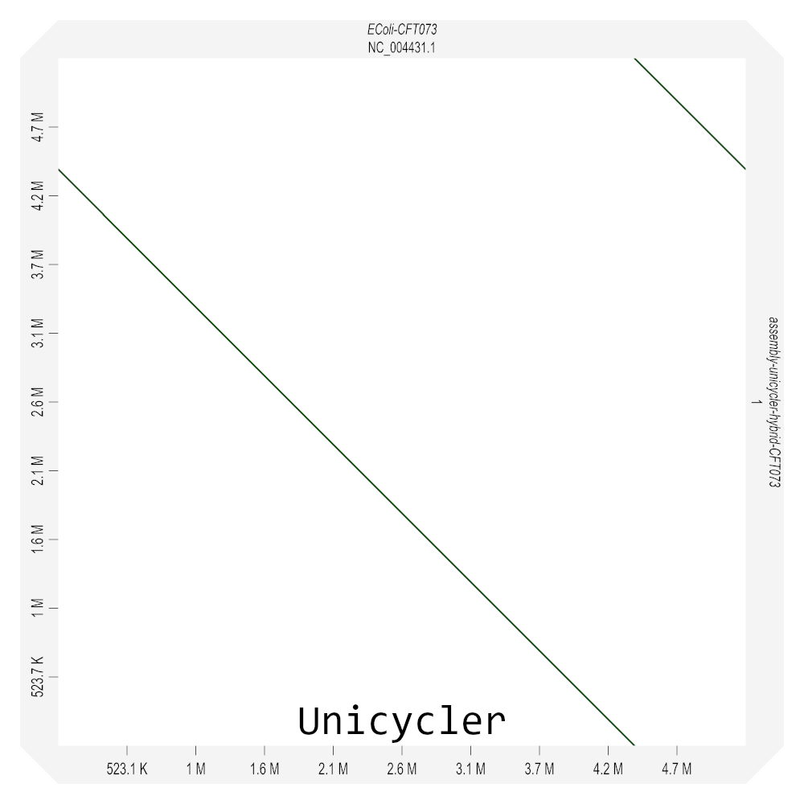
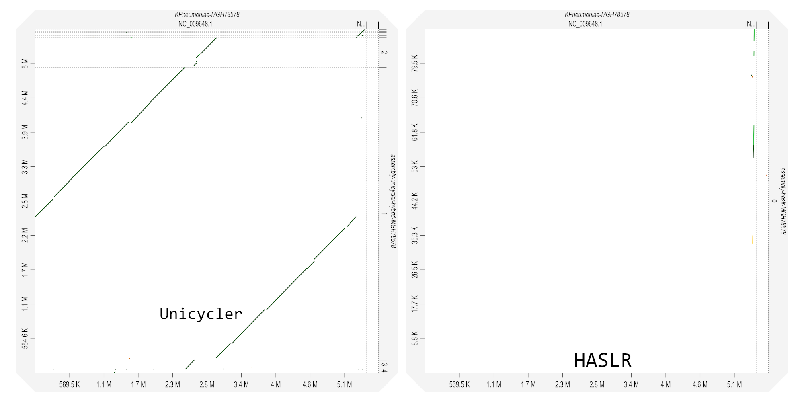
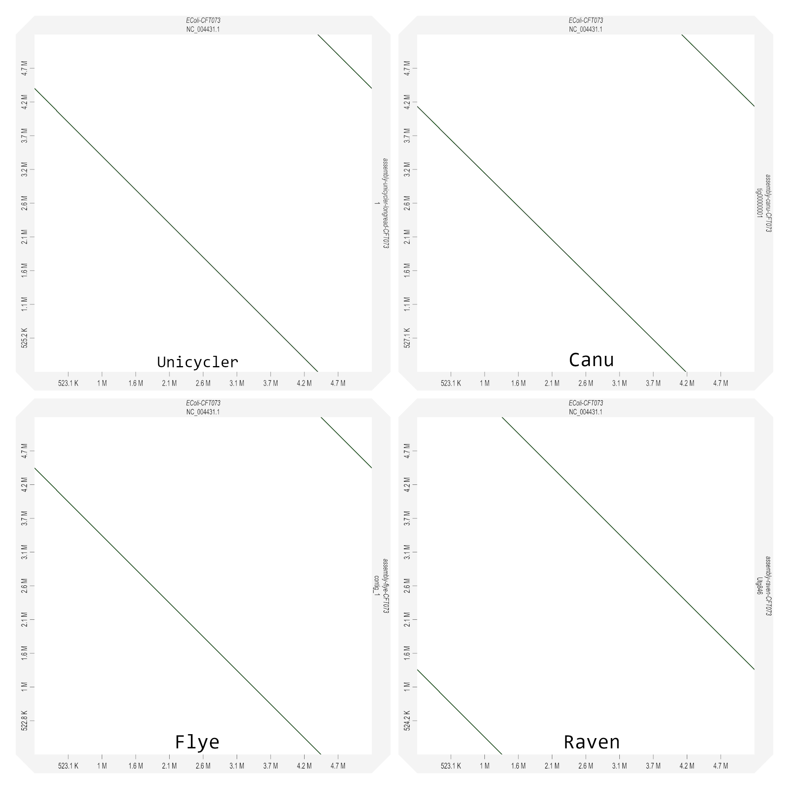
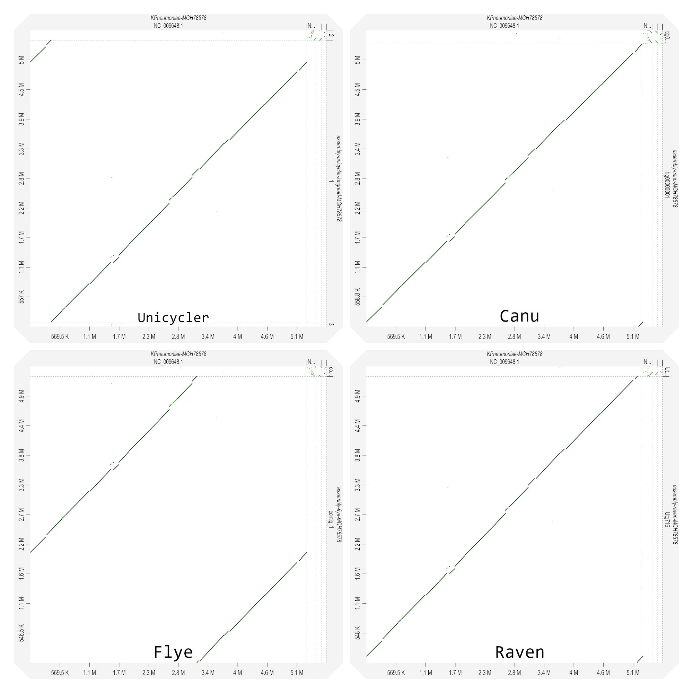

# Researchproject: 
### Comparison of hybrid/longread assembly software and elaboration of a best practice
***
***
# Overview

With the advance of new sequencing technologies, the demands on and possibilities of bioinformatic software for data analysis and genome reconstruction are increasing. Accordingly, a large variety of tools for genome reconstruction has been established over the years.1
This research project tries to give an overview of the state of the art software for whole genome assembly of prokaryotes: Based on a literature review a promising pre-selection of assembly software is made and it is investigated which metrics are useful to assess assembly quality. In a subsequent analysis the following questions are dealt with in particular:

- Do some assemblers perfrom significantly better than others?
- What edge cases (regarding read data and the underlying genome) are problematic for which assemblers?
- Can longread only assemblies compete with hybrid assemblies?
- How low can read coverage become until a significant drop in assembly quality is observed? (This also aims to reduce costs for sequencing experiments.)

The final goal of the project is the elaboration of a best practice (possibly comprising a script) based on the findings of the assembly software evaluation. The evaluation covers different project phases which are discussed in more detail below. To keep track of the projects progress the different phases are marked with a checkmar once completed.

- [Literature Research](#literature-research-and-acquisition-of-reference-data) :heavy_check_mark:
- [First round of evaluation](#first-round-of-evaluation)
- [Acquisition of more complex input data](#acquisition-of-more-complex-input-data)
- [Second round of evaluation](#second-round-of-evaluation)
- [Conclusion and best practice](#conclusion-and-best-practice)
- [References](#references)
&nbsp;
***
# Literature research and acquisition of reference data

Based on benchmarks and comparisons of longread as well as hybrid assembly software published from 2019 to 20202-5 promising candidates for further testing, based on the conclusions of the respective authors, were selected.

The same articles were examined with regard to the authors' evaluation methods and the accessibility of the reference data sets used.

In addition it was searched for recently developed assemblers, polishing software and evaluation methods which may not have been covered in the benchmarks.

## Results

A tabular overview of the software covered by the investigated literature is given below. Entries with a * were not covered in any publications but still considered for further steps.

| Long-read assembler                                                                                         | Hybrid assembler                                   | Assembly polisheri                                                                             | Assembly evaluation                           |
|-------------------------------------------------------------------------------------------------------------|----------------------------------------------------|-----------------------------------------------------------------------------------------------|-----------------------------------------------|
| [Unicycler](https://github.com/rrwick/Unicycler)                                                            | [Unicycler](https://github.com/rrwick/Unicycler)   | [Minipolish](https://github.com/rrwick/Minipolish) ([Racon](https://github.com/isovic/racon)) | [Quast](https://github.com/ablab/quast)       |
| [Canu](https://github.com/marbl/canu)                                                                       | [SPAdes-hybrid](https://github.com/ablab/spades)   | [NextPolish](https://github.com/Nextomics/NextPolish)                                         | [ALE](https://github.com/sc932/ALE)           |
| [Flye](https://github.com/fenderglass/Flye)                                                                 | [MaSuRCA](https://github.com/alekseyzimin/masurca) | [Pilon](https://github.com/broadinstitute/pilon)                                              | [MUMmer4](https://github.com/mummer4/mummer)  |
| [Miniasm](https://github.com/lh3/miniasm)/[Minipolish](https://github.com/rrwick/Minipolish)                                                        | [HASLR](https://github.com/vpc-ccg/haslr)*         | [Medaka](https://github.com/nanoporetech/medaka)*                                             | [REAPR](https://www.sanger.ac.uk/tool/reapr/) |
| [NECAT](https://github.com/xiaochuanle/NECAT)                                                               |                                                    |                                                                                               | [GMASS](https://github.com/jkimlab/GMASS)*    |
| [Raven](https://github.com/lbcb-sci/raven)                                                                  |                                                    |                                                                                               |                                               |
| [Redbean](https://github.com/ruanjue/wtdbg2)                                                                |                                                    |                                                                                               |                                               |
| [Shasta](https://github.com/chanzuckerberg/shasta)                                                          |                                                    |                                                                                               |                                               |
| [NextDenovo](https://github.com/Nextomics/NextDenovo)/[NextPolish](https://github.com/Nextomics/NextPolish) |                                                    |                                                                                               |                                               |

i <small>Assembly polisher software uses short- or long-reads to refine an assembly and to correct errors.</small> 

Based on the authors conclusions **Unicycler (hybrid and longread)**, **Canu**, **Flye** and **Raven** were selected as promising candidates for further testing. In addition the newly developed (January 2020) hybrid assembler **HASLR** was included, though it was not considered in the benchmarks.

Reference genomes, comprising [*Escherichia coli* strain CFT073](https://www.ncbi.nlm.nih.gov/nuccore/NC_004431.1) and [*Klebsiella pneumoniae* strain MGH78578](https://www.ncbi.nlm.nih.gov/nuccore/NC_009648.1) with 5 plasmids ([pKN3](https://www.ncbi.nlm.nih.gov/nuccore/NC_009649.1), [pKN4](https://www.ncbi.nlm.nih.gov/nuccore/NC_009650.1), [pKN5](https://www.ncbi.nlm.nih.gov/nuccore/NC_009651.1), [pKN7](https://www.ncbi.nlm.nih.gov/nuccore/NC_009652.1), [pKN8](https://www.ncbi.nlm.nih.gov/nuccore/NC_009653.1)), and the [associated raw sequencing data](https://www.ncbi.nlm.nih.gov/bioproject/PRJNA422511) were collected from De Maio et al.5.

Assembly polishing and evaluation methods will be covered in more detail in the following sections.

***
# First round of evaluation

Before the assembly was performed, possible adapters of the ONT reads were removed using Porechop and the quality of all reads was validated using FastQC.

For each assembly a dotplot was created using D-Genies to get a top-level impression of the quality of the assemblies.

Furthermore, all assemblies were evaluated on a finer level with Quast: Quast provides the most important metrics for the evaluation of assemblies like GC content, length comparisons, indicators for miss assemblies like repetitive regions, local miss assemblies like indels, insertions and gaps as well as statistics for read coverage and structural variations. The latter option was not chosen for the first run, since it is not clear to what extent the genomes of the cultures from which the reads were taken actually correspond to the references and this factor plays only a minor role for a first rough evaluation.

## Results

Except for HASLR on the E.Coli CFT073 dataset all assemblies were able to complete without errors. HASLR did not produce any assembly on the mentioned dataset while no error was thrown.

In the following the dotplots created with D-Genies are depicted. 

##### Hybrid assemblies, reference E.Coli CFT073
 

##### Hybrid assemblies, reference K.Pneumoniae MGH78578
 

##### Longread assemblies, reference E.Coli CFT073
 

##### Longread assemblies, reference K.Pneumoniae MGH78578
 

**Note:** The parallel two lines of the plots are likely to arise due to the fact that the assemblies do not start at the same absolute genomic positions compared to the reference.

From the dotplots it is clearly visible that:
1. HASLR failed to reconstruct the genome of the K.Pneumoniae MGH78578 reference completely.
2. All other assemblers did not perform apparently different compared to each other.
3. The assemblies of the E.Coli dataset have a much higher contiguity compared to the K.Pneumoniae dataset.

***
# Acquisition of more complex input data
...

## Results
...
***
# Second round of evaluation
...

## Results
...
***
# Conclusion and best practice
...

## Results
...

***
## References
1 [Alice Maria Giani, et al. *Long walk to genomics: History and current approaches to genome sequencing and assembly.* Computational and Structural Biotechnology Journal, Volume 18, Pages 9-19, 2020.](https://www.sciencedirect.com/science/article/pii/S2001037019303277)

2 [Goldstein, S., Beka, L., Graf, J. et al. *Evaluation of strategies for the assembly of diverse bacterial genomes using MinION long-read sequencing.* BMC Genomics, Volume 20, Number 23, 2019.](https://bmcgenomics.biomedcentral.com/articles/10.1186/s12864-018-5381-7#citeas)

3 [Chen, Z., Erickson, D.L. & Meng, J. *Benchmarking hybrid assembly approaches for genomic analyses of bacterial pathogens using Illumina and Oxford Nanopore sequencing.* BMC Genomics, Volume 21, Number 631, 2020.](https://bmcgenomics.biomedcentral.com/articles/10.1186/s12864-020-07041-8)

4 [Wick RR and Holt KE. *Benchmarking of long-read assemblers for prokaryote whole genome sequencing [version 3; peer review: 4 approved].* F1000Research 2020, 8:2138](https://f1000research.com/articles/8-2138/v3)

5 [De Maio N, Shaw LP, Hubbard A, et al. *Comparison of long-read sequencing technologies in the hybrid assembly of complex bacterial genomes.* Microb Genom. 5(9), 2019.](https://www.ncbi.nlm.nih.gov/pmc/articles/PMC6807382/)
