# Researchproject: 
### Comparison of hybrid/longread assembly software and elaboration of a best practice
***
***
# Overview

With the advance of new sequencing technologies, the demands on and possibilities of bioinformatic software for data analysis and genome reconstruction are increasing. Accordingly, a large variety of tools for genome reconstruction has been established over the years.1
This research project tries to give an overview of the state of the art software for whole genome assembly of prokaryotes: Based on a literature review a promising pre-selection of assembly software is made and it is investigated which metrics are useful to assess assembly quality. In a subsequent analysis the following questions are dealt with in particular:

- Do some assemblers perfrom significantly better than others?
- What edge cases (regarding read data and the underlying genome) are problematic for which assemblers?
- Can longread only assemblies compete with hybrid assemblies?
- How low can read coverage become until a significant drop in assembly quality is observed? (This also aims to reduce costs for sequencing experiments.)

The final goal of the project is the elaboration of a best practice (possibly comprising a script) based on the findings of the assembly software evaluation. The evaluation covers different project phases which are discussed in more detail below. To keep track of the projects progress the different phases are marked with a checkmar once completed.

- [Literature research and acquisition of reference data](#literature-research-and-acquisition-of-reference-data) :heavy_check_mark:
- [Assembly of reference datasets](#assembly-of-reference-datasets) :heavy_check_mark:
- [Downsampling of reads to decrease coverage depth](#downsampling-of-reads-to-decrease-coverage-depth)
- [Detection of SNPs](#detection-of-snps)
- [Conclusion and best practice](#conclusion-and-best-practice)
- [References](#references)
&nbsp;
***
# Literature research and acquisition of reference data

Based on benchmarks and comparisons of longread as well as hybrid assembly software published from 2019 to 20202-5 promising candidates for further testing, based on the conclusions of the respective authors, were selected.

The same articles were examined with regard to the authors' evaluation methods and the accessibility of the reference data sets used.

In addition it was searched for recently developed assemblers, polishing software and evaluation methods which may not have been covered in the benchmarks.

A tabular overview of the software covered by the investigated literature is given below. Entries with a * were not covered in any publications but still considered for further steps.

| Long-read assembler                                                                                         | Hybrid assembler                                   | Assembly polisheri                                                                             | Assembly evaluation                           |
|-------------------------------------------------------------------------------------------------------------|----------------------------------------------------|-----------------------------------------------------------------------------------------------|-----------------------------------------------|
| [Unicycler](https://github.com/rrwick/Unicycler)                                                            | [Unicycler](https://github.com/rrwick/Unicycler)   | [Minipolish](https://github.com/rrwick/Minipolish) ([Racon](https://github.com/isovic/racon)) | [Quast](https://github.com/ablab/quast)       |
| [Canu](https://github.com/marbl/canu)                                                                       | [SPAdes-hybrid](https://github.com/ablab/spades)   | [NextPolish](https://github.com/Nextomics/NextPolish)                                         | [ALE](https://github.com/sc932/ALE)           |
| [Flye](https://github.com/fenderglass/Flye)                                                                 | [MaSuRCA](https://github.com/alekseyzimin/masurca) | [Pilon](https://github.com/broadinstitute/pilon)                                              | [MUMmer4](https://github.com/mummer4/mummer)  |
| [Miniasm](https://github.com/lh3/miniasm)/[Minipolish](https://github.com/rrwick/Minipolish)                                                        | [HASLR](https://github.com/vpc-ccg/haslr)*         | [Medaka](https://github.com/nanoporetech/medaka)*                                             | [REAPR](https://www.sanger.ac.uk/tool/reapr/) |
| [NECAT](https://github.com/xiaochuanle/NECAT)                                                               |                                                    |                                                                                               | [GMASS](https://github.com/jkimlab/GMASS)*    |
| [Raven](https://github.com/lbcb-sci/raven)                                                                  |                                                    |                                                                                               |                                               |
| [Redbean](https://github.com/ruanjue/wtdbg2)                                                                |                                                    |                                                                                               |                                               |
| [Shasta](https://github.com/chanzuckerberg/shasta)                                                          |                                                    |                                                                                               |                                               |
| [NextDenovo](https://github.com/Nextomics/NextDenovo)/[NextPolish](https://github.com/Nextomics/NextPolish) |                                                    |                                                                                               |                                               |

i <small>Assembly polisher software uses short- or long-reads to refine an assembly and to correct errors.</small> 

Based on the authors conclusions **Unicycler (hybrid and longread)**, **Canu**, **Flye** and **Raven** were selected as promising candidates for further testing. In addition the newly developed (January 2020) hybrid assembler **HASLR** was included, though it was not considered in the benchmarks and the longread consensus tool **Trycycler** was used.

Reference genomes, comprising [*Escherichia coli* strain CFT073](https://www.ncbi.nlm.nih.gov/nuccore/NC_004431.1) and [*Klebsiella pneumoniae* strain MGH78578](https://www.ncbi.nlm.nih.gov/nuccore/NC_009648.1) with 5 plasmids ([pKN3](https://www.ncbi.nlm.nih.gov/nuccore/NC_009649.1), [pKN4](https://www.ncbi.nlm.nih.gov/nuccore/NC_009650.1), [pKN5](https://www.ncbi.nlm.nih.gov/nuccore/NC_009651.1), [pKN7](https://www.ncbi.nlm.nih.gov/nuccore/NC_009652.1), [pKN8](https://www.ncbi.nlm.nih.gov/nuccore/NC_009653.1)), and the [associated raw sequencing data](https://www.ncbi.nlm.nih.gov/bioproject/PRJNA422511) were collected from De Maio et al.5. In addition, short- and longreads of [*Staphylococcus aureus* strain RN4220](https://www.ncbi.nlm.nih.gov/nuccore/NZ_AFGU00000000.1) were provided by the group: The longreads are provided in two versions with different basecaller versions being used to call the nucleotides. The reference genome was taken from Nair et al.6; the RN4220 reference is fragmented into 179 contigs.

***
# Assembly of reference datasets

## Procedure

Before the assemblies were conducted, possible adapters of the ONT reads were removed using Porechop and the quality of all reads was validated using FastQC. For each of the reference genomes, short- and long-reads were mapped against the reference using bwa and a depth of coverage plot was created to get insights into which genomic regions are actually supported by the input data.

Next, all of the above listed tools were run with each of the reference datasets. For *S. aureus* two assemblies were run, one with the old and one with the newer reads (regarding the basecaller version):
  - As all tools except canu, which performs an internal read correction, were described as being applicable to raw reads, no pre-assembly longread correction was performed.
  - As canu does not include an automated assembly polishing step Medaka was used to polish the canu assemblies.

An illustrated pipeline of **Trycycler** can be seen [here](https://github.com/rrwick/Trycycler/wiki/Illustrated-pipeline-overview). It comprises a more manual procedure in which different longread assemblies are clustered based on their distance calculated with [**Mash**](https://genomebiology.biomedcentral.com/articles/10.1186/s13059-016-0997-x), sizes and indels.
  - For all trycycler runs as many as possible longread assemblies were considered.
  - In some cases contigs had to be removed due to low similarity to the other input contigs. This will be listed in the results section.

Furthermore, all assemblies were evaluated on a finer level with Quast: Quast provides the most important metrics for the evaluation of assemblies like GC content, length comparisons, indicators for miss assemblies like repetitive regions, local miss assemblies like indels, insertions and gaps as well as statistics for read coverage and structural variations.

## Results

### FastQC readquality

The FastQC reports revealed mean short read qualities of above 28 for all samples and all read positions and long read qualities of ranging from 12 to 18 for the E. coli and K. pneumoniae reads, 14 to 24 for the old basecaller version S. aureus reads and 14 to 32 for the new basecaller version S. aureus reads.

### Depth of coverage across references

The following plots depict the average (across a specific resolution, e.g. 10 kBp intervals) depth of coverage of the E. coli and K. pneumoniae references. The left side shows longread coverage while the right side shows short read coverage.

##### Depth of coverage, reference E. coli CFT073
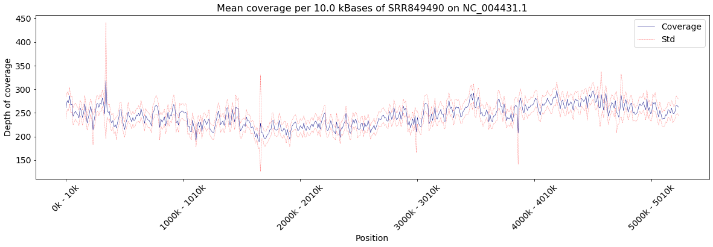 
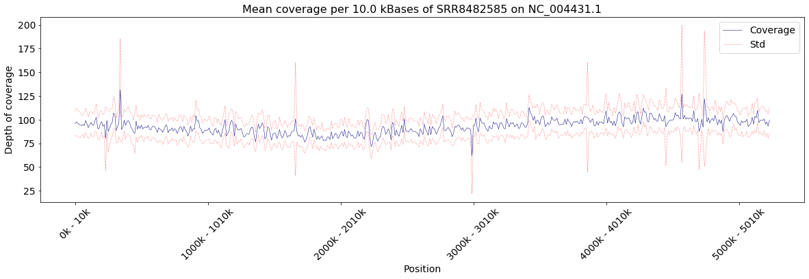 

##### Depth of coverage, reference K. pneumoniae MGH78578, genome
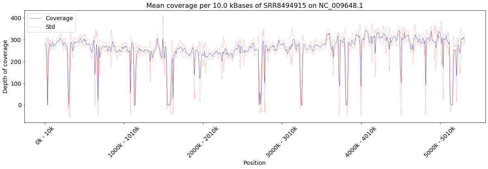 
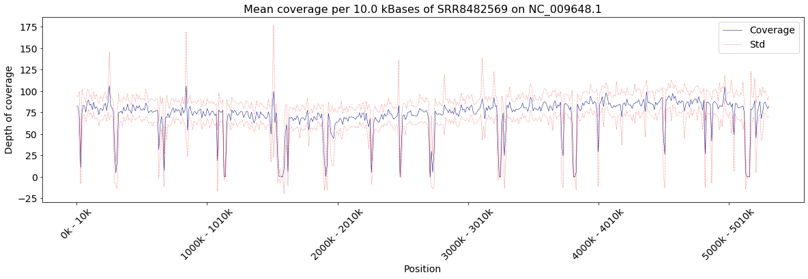 

##### Depth of coverage, reference K. pneumoniae MGH78578, plasmid one
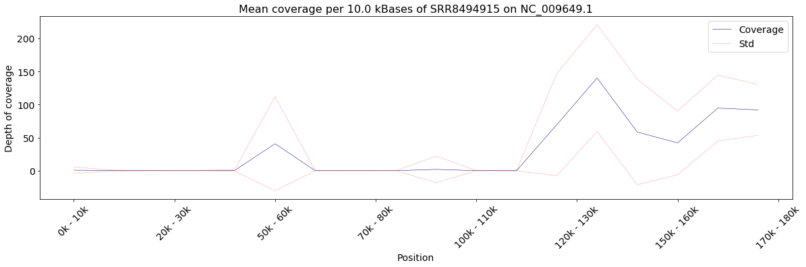 
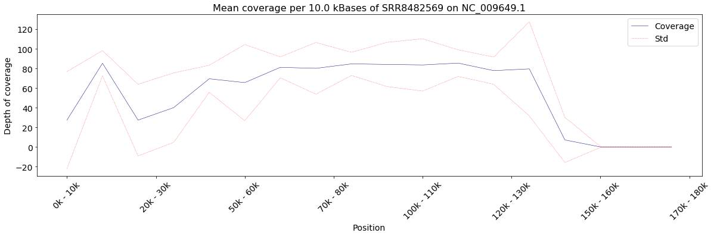 

##### Depth of coverage, reference K. pneumoniae MGH78578, plasmid two
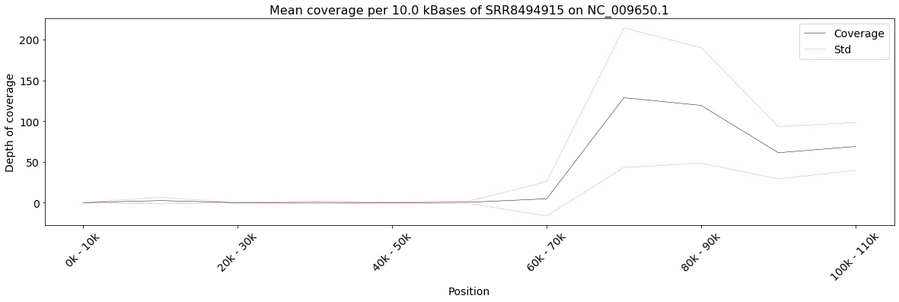 
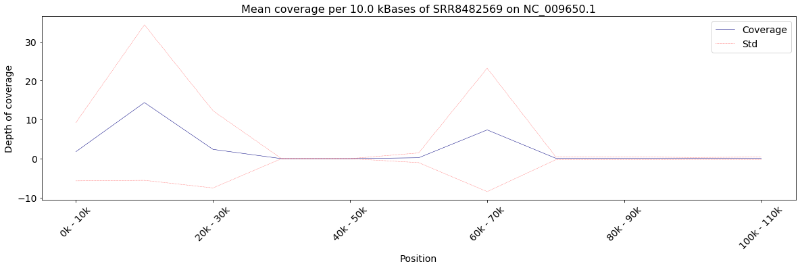 

##### Depth of coverage, reference K. pneumoniae MGH78578, plasmid three
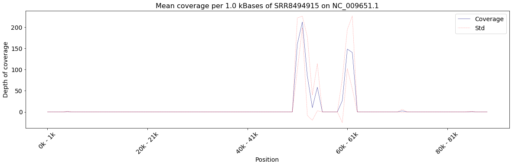 
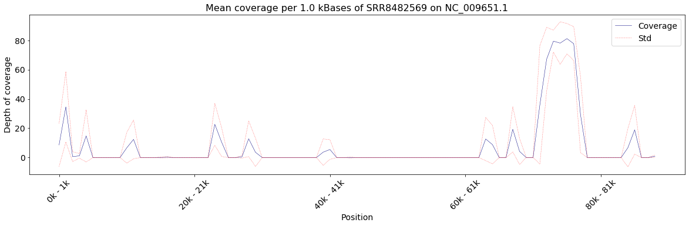 

##### Depth of coverage, reference K. pneumoniae MGH78578, plasmid four
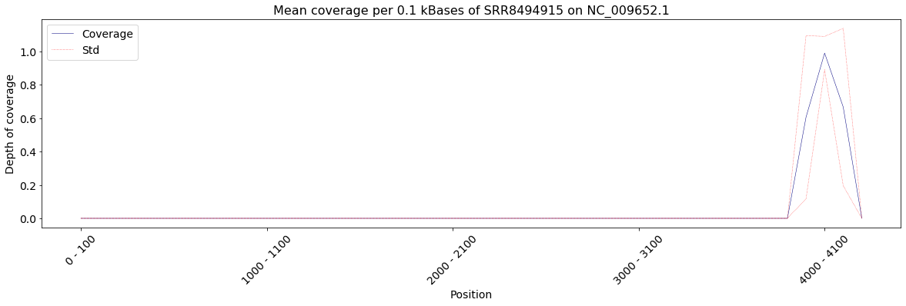 
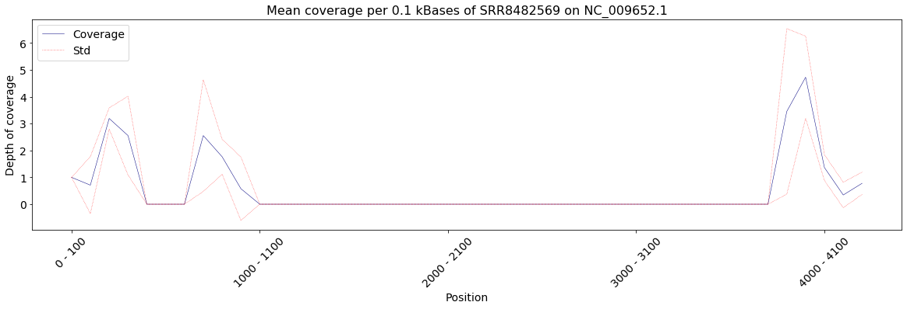 

##### Depth of coverage, reference K. pneumoniae MGH78578, plasmid five
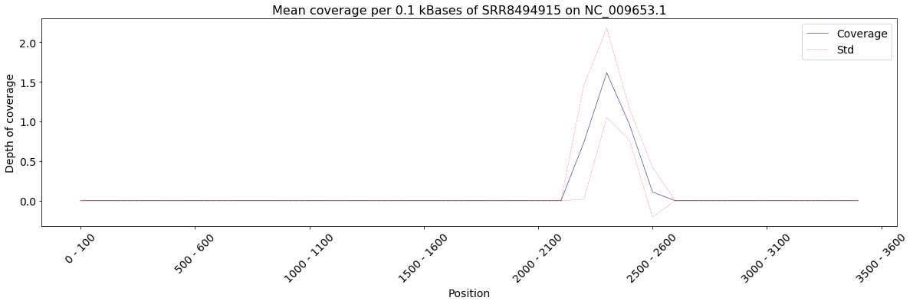 
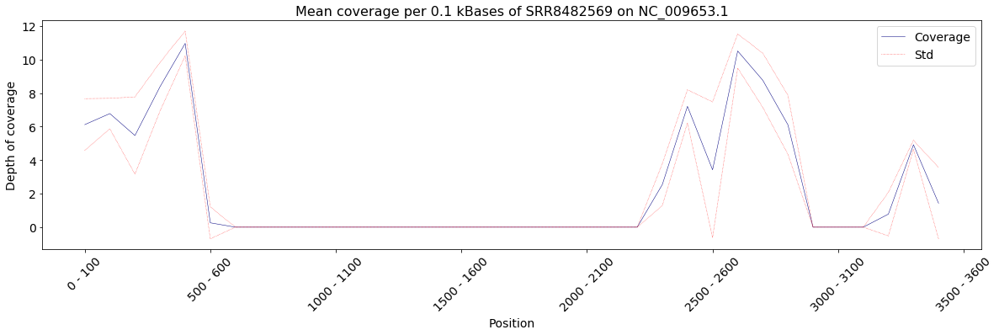 

As the S. aureus reference genome was highly fragmented it was decided to depict average depth of coverage and length per contig. The contigs were sorted by their length. We see a low correlation of length and coverage.

##### Depth of coverage, reference S. aureus RN4220
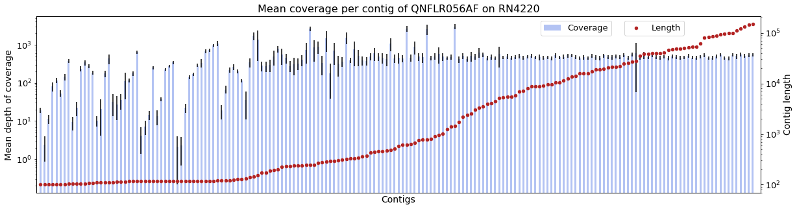 
 

The following table depicts the percentages (relative to the reference genome length) of zero coverage depth of read sets.

|           | E. coli CFT073 | K. pneumoniae MGH78578 | S. aureus RN4220              |
|-----------|----------------|------------------------|-------------------------------|
| shorteads | 0.046 %        | 10.924 %               | 0.006 %                       |
| longreads | 0.0 %          | 11.238 %               | 0.008 % (old) / 0.005 % (new) |

### Completion of assemblies

  - Except for HASLR on the E. coli CFT073 dataset all assemblies were able to complete without errors.
  - HASLR did only output a very short assembly of the K. pneumoniae MGH78578 genome.
  - Raven did only output a very short assembly of the S. aureus RN4220 genome for both longread versions.

### Trycycler runs

For all Trycycler runs all of the respective longread assemblies were used as input. In some cases whole assemblies or some contigs had to be deleted.

### Quast results

The full Quast .html reports are deposited on this git. Here, only some of the reported features, considered worth discussing, are presented. All quast commands were run with the *--no-icarus* option and the *--fragmented* option was used for the S. aureus assemblies.

The following table depicts the genomic fraction of the assemblies in percent and the number of different missassemblie events considered by Quast:
  - *relocations* are gaps or overlaps of at least 1kbp of the alignment of the assembly to the reference.
  - *translocations* and *inversions* are alignments on different chromosomes and strands, respectively.

|                          | E. coli CFT073 | K. pneumoniae MGH78578 | S. aureus RN4220 |
|--------------------------|----------------|------------------------|------------------|
| Genome fraction (%)      | > 99.9 %       | > 86.5 %               | > 99.5 %         |
| Number of relocations    | 3-4            | 41 - 53                | 0                |
| Number of translocations | 0              | 0                      | 9-14 (10-13)     |
| Number of inversions     | 0              | 2                      | 0                |

While the number of relocations of the K. pneumoniae and the number of translocations of the S. aureus assemblies can be easily explaiend by the structure of the references (regions of no coverage and multiple contigs), the number of relocations in E. coli assemblies and inversions in K. pneumoniae may be real differences from the reference genome to the genome of the sample that was actually sequenced.

In addition the number of contigs differed much for the hybrid versus longread approach on the K. pneumoniae reference. For all other references all assemblers agreed on 1 to 2 contigs.
  - In K. pneumoniae the Unicycler (hybrid) approach produced 16 contigs versus 2 to 3 contigs for all other assemblers; This may be due to the fact that some regions in reference plasmids have a low short read coverage but no long read coverage. As short reads were only used in the Unicycler (hybrid) approach to construct the architecture of the genome, the plasmids may have been sequenced as a set of very short fragments. This is also supported by the fact that the approach produced 4 contigs larger than 50,000 bp which is more close to the number of contigs produced by the other approaches.

The most significant differences of the assemblies were detected in the number of indels, mismatches and the number of genes that were predicted by GeneMarkS as well as the number of annotated genes that are being completely recovered from the assemblies. These features are depicted below: 

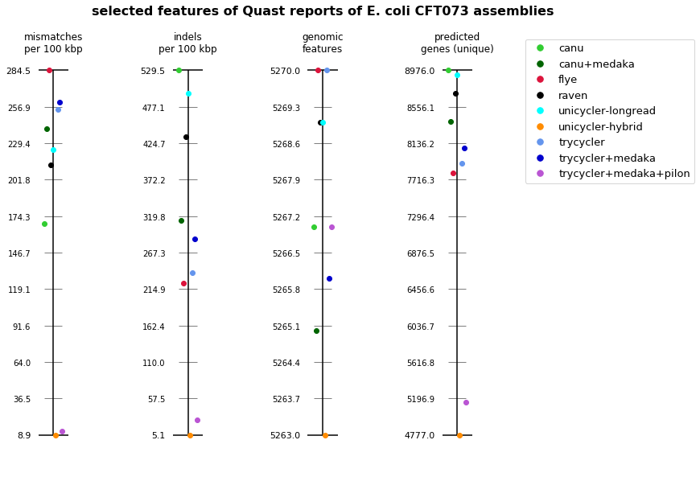 
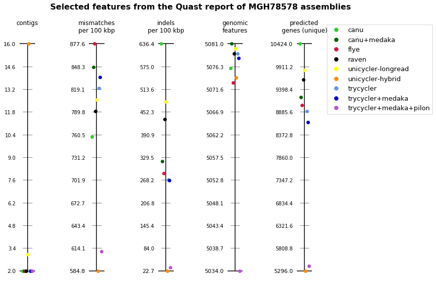 

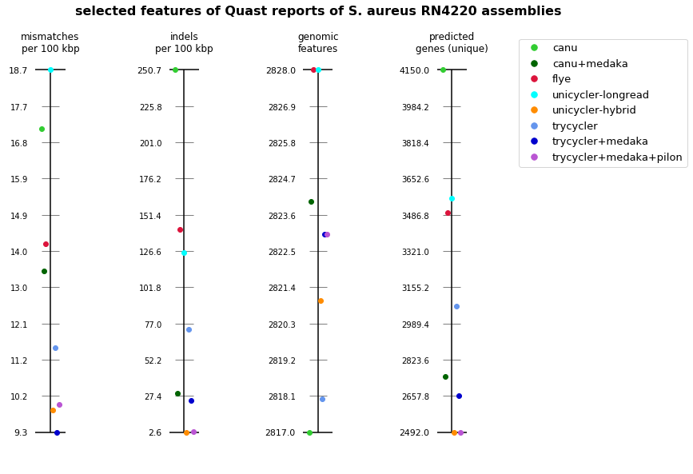 
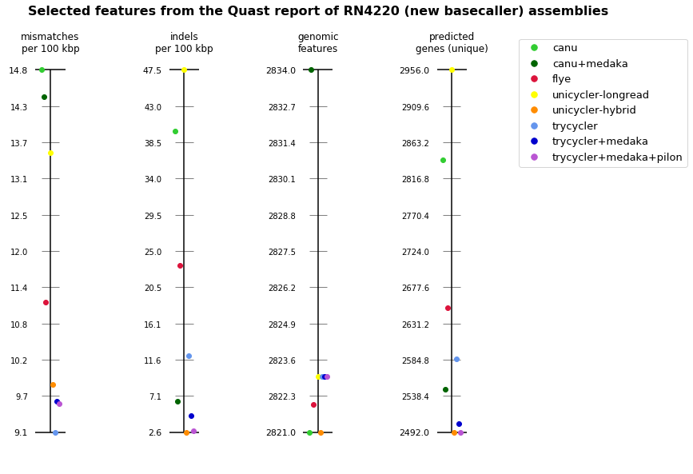 

  - From the pictures it is clearly visible that the number of predicted genes exceeds the number of annotated genes for the longread assemblies, except the S. aureus assembly with higher quality longreads. On the example of the CFT073 Canu and Unicycler (hybrid) assemblies it was investigated how many of the predicted genes are located inside an annotated/*true* gene and how the lengths of the annotated/*true* genes are distributed.

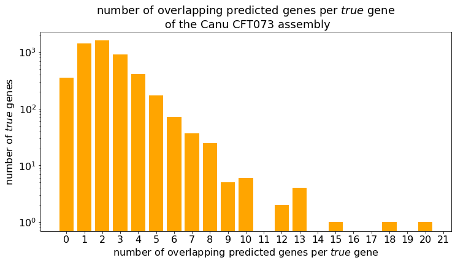 
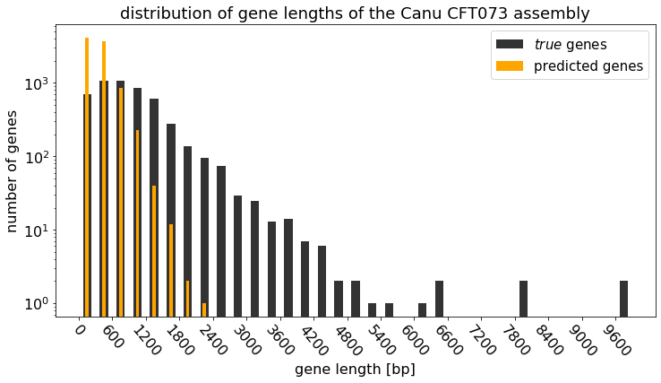 

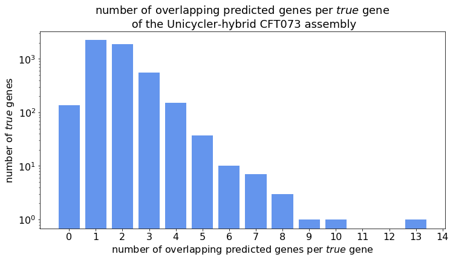 
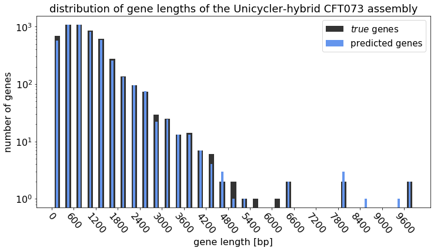 

The investigation reveals that indeed the predicted genes are much shorter than the annotated genes and multiple predicted genes are located inside annotated genes for the longread E. coli assembly. It can be suggested, that the low longread quality, which may have also led to the high number of mismatches, disturb the GeneMarkS prediction. However, here it is questionable why Quast reports the annotated genes as being completely recovered.

## Conclusion
  - All longread assemblers (except the one that did not produce correct output) managed to reconstruct the major parts of the reference genomes.
  - Comparing the longread assemblers to each other we see the main differences in the number of indels and mismatches compared to the respective reference. 
Above all we do not see that one specific assembler outperforms all other assemblers in all features or at least in one specific feature across all reference species.
  - The hybrid assembler (Unicycler) outperforms the longread assemblers regarding the number of indels and mismatches.
  - The fact that the Trycycler assemblies that were polished with short reads using Pilon perform close the the Unicycler (hybrid) assembler indicates that the performance difference is due to the quality differences of the reads or the fact that more information may be contained in the shortreads
  - The latter may be rejected as we have the same breadth and high enough depth of coverage for both read types and the S. aureus longreads with higher quality resulted in better results for the longread assemblers. Here, especially the number of indels was greatly decreased.
  
***
# Downsampling of reads to decrease coverage depth

## Procedure

Next the effect of the coverage depth of longreads on the assemblies is investigated. For this it was decided to consider the E. coli CFT073 reference as this is the only reference with a very good coverage of the reference. The tool [**Rasusa**](https://github.com/mbhall88/rasusa) was used to generate subsamples of the longreads with 200X, 150X, 100X, 80X, 60X, 40X, 20X, 15X, 10X, 8X and 6X coverage depth. For each of the subsamples all assemblers (except HASLR) were run. 

## Results

## Conclusion

***
# Detection of SNPs

## Procedure

## Results

## Conclusion

***
# Conclusion and best practice
***
## References
1 [Alice Maria Giani, et al. *Long walk to genomics: History and current approaches to genome sequencing and assembly.* Computational and Structural Biotechnology Journal, Volume 18, Pages 9-19, 2020.](https://www.sciencedirect.com/science/article/pii/S2001037019303277)

2 [Goldstein, S., Beka, L., Graf, J. et al. *Evaluation of strategies for the assembly of diverse bacterial genomes using MinION long-read sequencing.* BMC Genomics, Volume 20, Number 23, 2019.](https://bmcgenomics.biomedcentral.com/articles/10.1186/s12864-018-5381-7#citeas)

3 [Chen, Z., Erickson, D.L. & Meng, J. *Benchmarking hybrid assembly approaches for genomic analyses of bacterial pathogens using Illumina and Oxford Nanopore sequencing.* BMC Genomics, Volume 21, Number 631, 2020.](https://bmcgenomics.biomedcentral.com/articles/10.1186/s12864-020-07041-8)

4 [Wick RR and Holt KE. *Benchmarking of long-read assemblers for prokaryote whole genome sequencing [version 3; peer review: 4 approved].* F1000Research 2020, 8:2138](https://f1000research.com/articles/8-2138/v3)

5 [De Maio N, Shaw LP, Hubbard A, et al. *Comparison of long-read sequencing technologies in the hybrid assembly of complex bacterial genomes.* Microb Genom. 5(9), 2019.](https://www.ncbi.nlm.nih.gov/pmc/articles/PMC6807382/)

6[Dhanalakshmi Nair, Guido Memmi, et al. *Whole-Genome Sequencing of Staphylococcus aureus Strain RN4220, a Key Laboratory Strain Used in Virulence Research, Identifies Mutations That Affect Not Only Virulence Factors but Also the Fitness of the Strain* Journal of Bacteriology  193 (9), Apr 2011 (https://jb.asm.org/content/193/9/2332)
